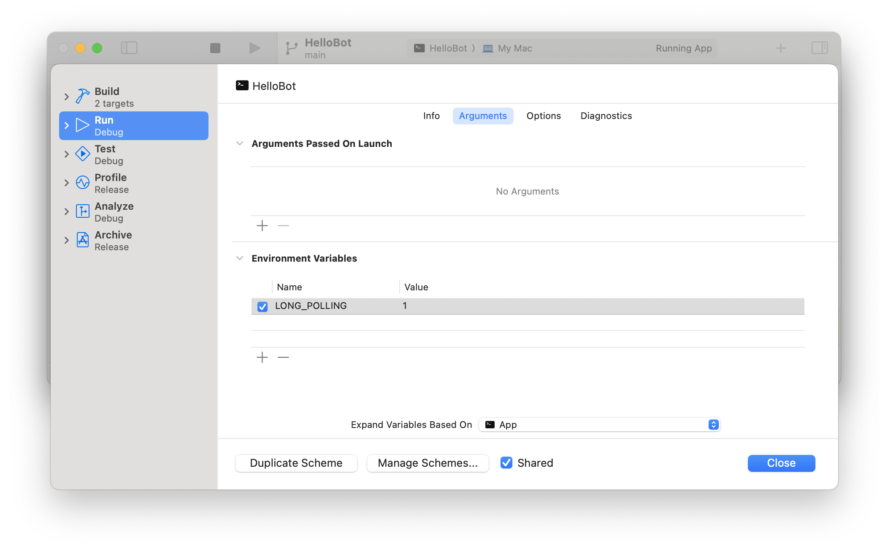

# CharBotSDK

## Создание нового проекта

1. Установить Vapor

https://docs.vapor.codes/4.0/install/macos/

2. Cоздать новый проект. Например будем использовать имя `HelloBot`

`vapor new HelloBot --template https://github.com/dmoroz0v/ChatBotSDKVaporTemplate`

Обратите внимание: если на вопросы нужен ли Fluent ответить положительно, то будет добавлена работа с БД и команды insert и select

3. Перейти в директорию проекта

`cd HelloBot`

4. Запустить проект в Xcode

Оставаясь в директории с проектом выполнить `vapor xcode`

5. [Опционально, если ответили что нужен Fluent] Прописать Custom Working Directory 

Быть уже в директории с проектом согласно пункту 3. Вывести путь через `pwd`, скопировать его и согласно документации https://docs.vapor.codes/getting-started/xcode/#custom-working-directory вставить. При запуске через terminal база данных создается в директории исходного кода, поэтому для запуска через xcode желательно указать такой путь - на случай если будете запускать то в терминале, то в xcode - чтобы использовалась одна и та же база данных

## Настройка телеграм бота

1. Создать бота через https://t.me/botfather

2. Получить у него токен

3. Перейти в файл `Sources/App/BotFactory.swift`

4. В параметр `token` вписать токен

## Запуск через long polling

1. Зайти в редактирование схемы

2. Указать `LONG_POLLING` в Environment Variables

3. Запустить `HelloBot`

## Что он уже умеет

В новом проекте сразу реализованы несколько команд для примера. Всего реализовано 6 команд:

`/revert` - команда попросит ввести строку и развернёт её

`/pick` - команда предложит выбрать 1 из 8 элементов

`/insert` - команда предложит ввести текст, который необходимо записать в базу данных

`/select` - команда выведет записи из базы данных, которые были добавлены командой /insert

`/cancel` - команда для отмены текущей выполняемой команды

`/help` - команда для получения справки

## Запуск через webhook

2. Настройка домена и порта.

2.1. Вам понадобится белый `ip` адрес.

2.2. Зарегистрировать домен. Предположим у нас такой домен `mybot.mydomain.ru`.

2.3. Прописать свой локальный ip адрес и домен в etc/hosts. У меня получилось вот так:

`192.168.0.110   mybot.mydomain.ru`

2.4. Прокинуть порт в своем роутере, я выбрал порт `8443`. Необходимо чтобы роутер редиректил входящий трафик по данному порту на ваш локальный `ip` адрес.

2.5. В `Sources/App/configure.swift` раcкоментировать строки и вписать в них домен и порт. У меня получилось вот так:

    app.http.server.configuration.hostname = "mybot.mydomain.ru"
    app.http.server.configuration.port = 8443

3. Сгенерировать сертификат.

3.1. Перейти в директорию `Cert`.

`cd HelloBot/Cert`

3.2. Запустить команду `openssl`.

`openssl req -newkey rsa:2048 -sha256 -nodes -keyout key.pem -x509 -days 3650 -out cert.pem`

Команда будет спрашивать ввод некоторых данных. Важно их все ввести и когда спросит домен, то ввести выбранный домен для бота `mybot.mydomain.ru`.

3.3. В `Sources/App/configure.swift` раскоментировать строки. У меня получилось вот так:

    try app.http.server.configuration.tlsConfiguration = .makeServerConfiguration(
        certificateChain: [
            .certificate(.init(
                file: "Cert/cert.pem",
                format: .pem
            ))
        ],
        privateKey: .file("Cert/key.pem")
    )

4. Регистрация `webhook`.

4.1. Перейти в директорию `Cert`.

`cd HelloBot/Cert`

4.2. Зарегистрировать `webhook` с помощью команды `curl` заменив `<token>` на токен бота полученого у `@BotFather`.

`curl -F "url=https://mybot.mydomain.ru:8443/webhook" -F "certificate=@cert.pem" https://api.telegram.org/bot<token>/setWebhook`

5. в схеме прописать `Working directory`

5.1. Перейти: Схема -> Options
5.2. Поставить галочку Use custom Working directory
5.3. Поставить путь до папки спроектом (у меня получился такой `/Users/<username>/Projects/hellobot`)

6. Запустить в Xcode схему `hellobot`.

7. Отправить боту одну из команд:

`/revert` - команда попросит ввести строку и развернёт её

`/pick` - команда предложит выбрать 1 из 8 элементов

`/insert` - команда предложит ввести текст, который необходимо записать в базу данных

`/select` - команда выведет записи из базы данных, которые были добавлены командой /insert

`/cancel` - команда для отмены текущей выполняемой команды

`/help` - команда для получения справки

## Deploy используя Docker

TBD